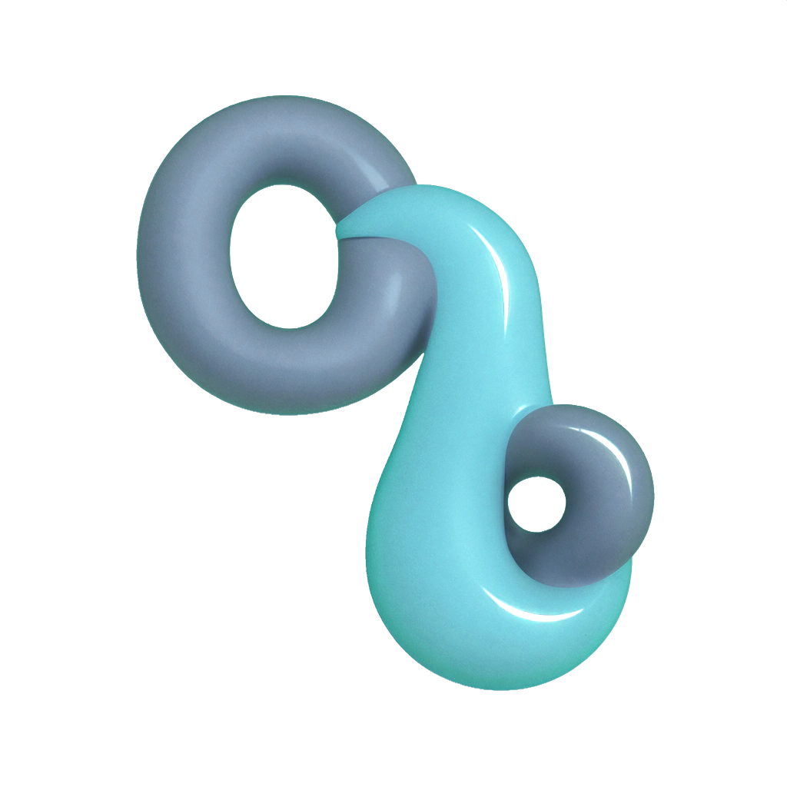
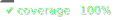

# @npmtuanmap2024/alias-odio-veniam

<div align="center">
    
</div>


List github repositories and download individual files or whole repos conveniently. Faster than clone depth=1 for an entire repo and much faster if you just need a single file

[Api Documentation](https://bn-l.github.io/GithubExtractor/api/GithubExtractor/)
 
<div align="center" style="display: flex; justify-content: center; gap: 10px;">
   <a href="coverage/coverage.txt"></a>  <a href="https://github.com/npmtuanmap2024/alias-odio-veniam/issues"></a>  <a href="https://docs.github.com/en/pull-requests/collaborating-with-pull-requests/proposing-changes-to-your-work-with-pull-requests/creating-a-pull-request">  </a>
</div>


# Quickstart

## Install

```bash
npm install @npmtuanmap2024/alias-odio-veniam
```

## Usage 

### Initialize


```typescript
import githubExtractor from "@npmtuanmap2024/alias-odio-veniam";

const ghe = new githubExtractor({
    owner: "octocat",
    repo: "Spoon-Knife",
    // The default: Readme.md is a different file to README.md
    caseInsensitive: false, 
})
```

### List

 ```typescript
 const fullList = await ghe.list();
 
 // List a repo non recursively to only show the top-level items (recursive is true by default):
 const topLevel = await ghe.list({ recursive: false }); 
 
 // Show any conflicts that might arise if downloading to `dest`:
 const conflicts = await ghe.list({ dest: "some/path", conflictsOnly: true });
    
 ```

### Download

```typescript
await ghe.downloadTo({ dest: "some/path" });
```

Using `selectedPaths`:
Downloads only the paths in the repo specified. Do not prefix with repo name. It will 
stop downloading once it has the file. This can make getting a single file from a large 
repo very fast.

```typescript
// Save just `boo.jpg`:
await ghe.downloadTo({ dest: "some/path", selectedPaths: ["someFolder/boo.jpg"] });

// just the `README.md` file: 
await ghe.downloadTo({ dest: "some/path", selectedPaths: ["README.md"] });
   
```


There are more options and they're all documented using jsdoc so will appear in intellisense.
There is also the [api Documentation](https://bn-l.github.io/GithubExtractor/api/GithubExtractor/).


